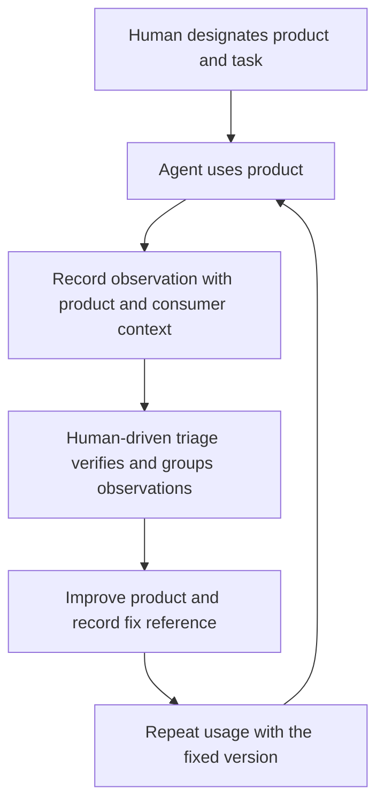

# papercut — understand how agents struggle to use your products

Direction agreed on 2026-09-29. The product attribution, product views, and
reports-only capture policy and a two-CLI usage pilot are implemented in this
checkout. Installation into real agent environments and any release remain
separate work. The implementation sequence and release gates are at the end of
this document.

## Purpose

Papercut records where coding agents struggle to use a designated product, so its
maintainer can improve that product's installation, documentation, interfaces,
behavior, and errors. Initial use cases are SDKs and CLIs used in real tasks.

The human chooses the products they care about. The agent is the primary CLI
caller and supplies observations while working. Triage turns those observations
into verified product improvements and checks whether later usage gets easier.

A product can be used from its own repo, a downstream application, a temporary
directory, or outside Git entirely. Its identity must survive those changes of
location. The central private store brings observations about the same product
together across consuming repos, tasks, and agent sessions.

## What qualifies

> A papercut is an observed obstacle, ambiguity, misleading result, or unnecessary
> effort encountered while an agent tries to accomplish a task through a
> designated product's supported or reasonably discoverable usage surface.

The usage surface includes installation, onboarding, public SDK APIs, CLI commands,
help, documentation, examples, output formats, and error handling. A command can
exit successfully and still produce a papercut. A workaround can complete the
task while leaving the product problem unresolved.

| Observation | Capture decision |
| --- | --- |
| The SDK quickstart omits initialization required by its example. | Include: onboarding or documentation friction. |
| CLI help advertises an option that the command rejects. | Include: a product contract the agent could not use. |
| Finding pagination requires several attempts despite following the public docs. | Include: discoverability friction, even when every call succeeds. |
| The target installer silently replaces a user's symlinks. | Include: a product bug encountered during installation; link an issue during triage. |
| A supported setup path requires an undocumented external tool. | Include: the product's prerequisite handling is part of the experience. |
| An unrelated shell alias causes an overwrite prompt. | Exclude: incidental environment trouble. |
| A browser unrelated to the designated product is missing. | Exclude: incidental tooling trouble. |
| An agent guesses an internal filename while editing an implementation. | Exclude: ordinary code exploration without evidence about product usage. |
| A plausible CLI flag guess fails because related commands or examples suggest it. | Include the expectation and its basis; triage decides whether the interface should improve. |
| An agent proposes a feature without encountering a concrete usage obstacle. | Exclude: a speculative feature request. |

Running a project's internal build or tests during maintenance is ordinarily
development context. A documented build-from-source installation path, or a test
reproducing difficulty with the public API, can be evidence about product usage.
Being inside a product's source repo does not make every failed command relevant.

Reporters need evidence of an interaction with the target product, not proof of
root cause. A single agent mistake does not establish a product defect. Preserve
the expectation, the observation, and uncertainty so triage can make that judgment.
Product bugs and missing capabilities encountered during a real task are valid
observations; an issue tracker can own the resulting implementation work.

## Product selection and attribution

1. The task or applicable product instructions designate one or more products to
   observe. Merely installing Papercut does not designate all tools on the machine.
2. Each new report names exactly one designated product using `--product <id>`.
   The first implementation uses this explicit argument; it has no implicit
   current product, global default, environment override, or registration service.
3. A product ID is a stable, nonempty, case-sensitive string chosen by the human,
   such as `@nibzard/example-sdk` or `papercut-cli`. Trim surrounding whitespace;
   reject an empty result. Use the same ID in subsequent tasks. IDs are data,
   never filesystem paths, and are not inferred from Git remotes or command names.
4. Record the product version or revision when it is already known or cheap to
   verify. Otherwise omit it. Never substitute the consuming repo's SHA for the
   product version. Record the particular surface when useful, such as
   `Client.items.list`, `install`, or `--help`.
5. Multiple products in a task remain separate targets. Attribute an observation
   to the surface that caused the difficulty and describe uncertain interactions
   in the report. Do not copy every task failure to every designated product.
6. With no designated product, the agent continues its task without reporting
   incidental failures. A direct `add` without `--product` is an honest usage
   error, not an inferred target or a silently saved unscoped report.

The agent can read the designation from normal task instructions; the Rust CLI
does not interpret natural language or determine whether a claim is valid. This
keeps capture cheap and puts interpretation in the agent and the review loop.

### Example workflow

Task: use `@nibzard/example-sdk` version `0.4.0` to list all items in a downstream
application; observe that SDK with Papercut.

```sh
papercut add --product '@nibzard/example-sdk' \
  --product-version 0.4.0 --surface 'Client.items.list' \
  -- 'Following the pagination example, I expected list() to expose a next-page cursor. It returned only an item array; finding the separate pages() iterator took three attempts. Using pages() completed the task.'

papercut list --product '@nibzard/example-sdk'
papercut triage-pack --product '@nibzard/example-sdk' --max-tokens 8000
```

The product views include observations from every consuming repo. A reviewer
checks the example against the recorded version, improves the SDK or its docs,
records the fix reference, and repeats the usage task with the improved version.

## Architecture and invariants



The first release under this plan uses agent reports. Existing general failure
adapters cannot establish which product was being used or explain successful but
confusing interactions. Automatic capture returns only after attribution has
been demonstrated for a concrete adapter; its requirements are below.

- **Capture stays cheap.** One local CLI call, no network, no model calls in the
  binary, no interactive prompts. Reporting must never derail the agent's task.
- **Errors stay honest.** The direct CLI returns 0 for success, 1 for a real
  failure, and 2 for a usage error. Hook entry points swallow every error and
  remain silent. A direct failed `add` must never claim the report was recorded.
- **Product identity is explicit.** The working repo describes where the product
  was used. It cannot stand in for the product being observed.
- **Observation, hypothesis, and suggested fix remain separate.** A verified
  workaround can be included in the observation; a speculative remedy belongs
  in `suggested_fix`.
- **Duplicates are evidence.** No capture-time deduplication or fingerprints.
  Prefer one report per apparent obstacle per product per session; independent
  recurrence remains visible for semantic review.
- **The store is private by default.** Use `$XDG_DATA_HOME/papercuts/`, otherwise
  `~/.local/share/papercuts/`. Publishing into a repo is an explicit act. No
  secrets, environment-variable values, transcripts, or source files in events.
- **The agent contract remains first-class.** Complete `--help`, non-interactive
  commands, `--output json` everywhere with the existing envelope, bounded error
  hints, and deterministic output. `install` requires `--yes`.
- **Implementation stays small.** One Rust binary using `clap`,
  `serde`/`serde_json`, `ulid`, and `anyhow`. No async runtime. Additional
  dependencies require Nik-Nak Attack's sign-off.
- **Managed blocks own their markers.** Installation and removal preserve
  surrounding instructions and unrelated harness settings.
- **Progress means better product usage.** A private machine workaround may
  unblock a task; it does not by itself resolve a product obstacle for later users.

## Data model and compatibility

Keep the existing store layout and one file per report:

```text
~/.local/share/papercuts/
  events/pc_<ulid>.json
  signals/<harness>/<session>.jsonl   # existing historical signals retained
  sweeps.json                       # existing sweep state retained
  config.json                       # installation metadata
```

### Event schema v2

New reports use schema v2 and add a required `product` object. Existing context,
category, source, status, observation, hypothesis, fix, and resolution semantics
are retained except for the product scope described in this plan.

```json
{
  "schema_version": 2,
  "id": "pc_<ulid>",
  "created_at": "2026-09-29T09:00:00Z",
  "source": "in_moment",
  "status": "open",
  "product": {
    "id": "@nibzard/example-sdk",
    "version": "0.4.0",
    "surface": "Client.items.list"
  },
  "summary": "Following the pagination example, I expected a next-page cursor. list() returned only an array. Finding pages() took three attempts; that iterator completed the task.",
  "hypothesis": "The pagination example may describe an older interface.",
  "suggested_fix": "Update the pagination example for this version.",
  "category": "docs",
  "context": {
    "repo": "github.com/example/consumer-app",
    "cwd": "examples",
    "git_sha": "abc1234",
    "agent": "codex",
    "session": "<harness session id when available>",
    "task": "SDK-42"
  }
}
```

- `product.id` is required for v2. `product.version` and `product.surface` are
  optional strings; supplied values must be nonblank. Versions are opaque strings
  so release numbers and commit references both work.
- `summary` stays the required observation. It should state the task, expected
  behavior and basis for that expectation, actual difficulty, and any verified
  workaround. Do not add mandatory structured fields for each sentence in this
  first iteration. `--task` remains an optional task reference.
- `context.repo`, `cwd`, and `git_sha` describe the consuming workspace. Product
  source location, user identity, and ownership are not inferred from it.
- Agent and session detection remain best effort. `unknown` agent and absent
  session metadata are acceptable; they do not invalidate product attribution.
- New in-the-moment reports start `open`. Preserve statuses `candidate`, `open`,
  `fixed`, `promoted`, `duplicate`, and `dismissed`, and sources `in_moment`,
  `sweep`, and `triage`. No signal automatically becomes a report.
- Every terminal status requires `resolution.reason`. `fixed` requires a
  nonempty `resolution.ref` identifying the landed product or documentation fix.
  A `promoted` resolution should link the product issue; promotion records a
  handoff and must not be counted as a verified fix.
- Event schema, installation config schema, managed-block version, and JSON
  envelope version are independent. Keep the envelope at v1. Decouple the
  current use of the event schema constant in installation config before writing
  v2 events; changing event format must not silently change config format.

### Existing reports

- Read and validate both v1 and v2. A v1 report without product attribution is
  displayed as **unattributed legacy evidence**, not as a product inferred from
  its repo. A v2 report missing its required product is invalid.
  Product attribution is authoritative only in a valid v2 record.
- `show` exposes the record's actual schema and complete stored fields. Readers
  never rewrite files, invent product versions, change IDs, or change statuses.
- Keep existing raw signal files and sweep state. Their repo, executable name,
  or proximity to a report is insufficient to establish a product identity.
- Historical reports can be explicitly reviewed and attributed by editing a
  selected event to v2 with a product object. Preserve its ID, timestamp, source,
  observation, and other existing fields. Back up the original outside the
  scanned `events/` directory. No bulk inference or automatic migration.
- For the motivating sample, the installer symlink report can be reviewed for
  attribution to `papercut-cli`; its `dotfiles` repo remains consumer context.
  Unrelated alias/build reports remain available as legacy history. Do not
  automatically delete or dismiss them as part of upgrading.
- Old binaries may skip v2 events as unsupported. Document that limitation and
  update all active harness installations before adopting the new capture
  instruction. Reading or downgrading must never destroy those files.

## Command surface

Existing commands remain. The new surface is limited to product attribution and
selection; product registries, sessions, and issue synchronization are deferred.

| Command | Planned behavior |
| --- | --- |
| `add --product <id> "<observation>"` | Write v2. Require product and observation; add optional `--product-version` and `--surface`. Retain `--task`, `--category`, `--agent`, `--hypothesis`, and `--fix`. Print the event ID. Missing or blank product is exit 2. |
| `list [--product <id>]` | Show product, known version/surface, full observation, short reference, status, consumer repo, and resolution. Preserve status/age/agent filters and readable text/JSON ordering. |
| `show <id-or-ref>` | Show every field of either schema. Exact ID or unique case-insensitive suffix; unknown ID exits 1, ambiguous reference exits 2. |
| `render [--product <id>]` | Deterministic markdown with product attribution. Preserve explicit `--write` and repo publication boundaries. |
| `triage-pack [--product <id>]` | Full product observations and context within the token budget, known versions/sessions/consumer repos, and clear omission counts. Default statuses remain open + candidate. |
| `list/render/triage-pack --unattributed` | Select legacy reports without product attribution for explicit review. Conflicts with `--product`. |
| `install --yes` | Install the v2 reporting block for detected harnesses; remove Papercut's old broad hook wiring when upgrading. Report partial failures honestly. |
| `uninstall` | Remove owned blocks and adapter wiring, preserve unrelated content and stored evidence. |
| `doctor` | Check store, instruction version, installation metadata, and retirement of old broad hook wiring. Report that automatic capture is unavailable pending product attribution; absence of a live adapter is healthy in this release. |
| `sweep` | Keep the command for compatibility. Return exit 0 with zero scanned sessions/signals and an explicit `capture_mode: "reports_only"` explanation in text/JSON. Do not scan historical sessions or advance watermarks. Preserve usage errors for invalid options. |

### Selection and projection rules

- With `--product <id>` and no explicit `--repo`, query all consuming repos.
  With both flags, use their intersection. `--product` is an exact ID match.
  Apply the same trimming and nonblank validation as `add`. Selecting an unknown
  product produces an explained empty view.
- `--unattributed` also spans repos unless `--repo` is explicit. With neither
  selector, retain the existing current-repo default, falling back to all repos
  outside Git. `--repo all` remains the explicit global view.
- Ordinary `list` and `render` views distinguish unattributed legacy reports
  from attributed product observations. Product views exclude legacy records.
  Default triage includes attributed reports only and notes excluded legacy
  counts in its scope; `--unattributed` is the explicit legacy review path.
- Preserve store-unique short references, status breakdowns, terminal reasons,
  readable plain text, and restrained terminal-only color. No new TUI dependency.
- Preserve scoped warnings for malformed files. Extend skip metadata to include
  product identity when it can be read safely. A product view must not expose
  unrelated products' corrupt-file details or pretend unreadable files match.
- `render --product <id> --write` with no repo filter writes the global projection
  inside the private store, even when invoked in a checkout. An explicit repo
  scope writes only matching consumer-context records into that repo's
  `PAPERCUTS.md`, and only when run from the matching working tree. It does not
  publish all downstream usage records into a product repo implicitly.
- Triage preserves complete observations and optional fields. Omit whole records
  when the soft token budget is exhausted, with counts and an omitted reference.
  Do not reserve space for unavailable automatic signals. Product/session counts
  describe observed reports; they are not measurements of all product usage.
  The CLI can group by explicit product metadata; semantic grouping by root cause
  remains a review-time judgment. Count missing session metadata separately.

Status updates remain explicit JSON edits with a resolution. Add `close`,
`promote`, or `dedupe` commands only after repeated manual-edit friction justifies
them. No comment stream or new history service is needed for this revision.

## Capture instructions and adapter transition

The global instruction introduces the reporting capability. A task or product
instruction supplies the target. The planned managed block is:

```markdown
<!-- papercut:begin v2 -->
### Observe designated products with Papercut
When a task or applicable instructions designate a product to observe, record
where using its installation, docs, public interface, behavior, or errors causes
confusion, retries, a dead end, a misleading result, or an unexpected workaround:

    papercut add --product <designated-product-id> -- "<task and expectation; what happened; any verified workaround>"

Include --product-version and --surface when known. Report relevant struggles
even when commands succeed or the task eventually works. Product bugs encountered
during use qualify. Exclude unrelated machine/tool failures, ordinary implementation
debugging, accomplishments, and speculative requests. Do not infer the product
from the working repo. With no designated product, continue without reporting.
If relevance to the designated product is uncertain, state the evidence and
uncertainty. Keep suspected causes in --hypothesis and proposed remedies in --fix.
One report per apparent obstacle per product per session. Never include secrets,
transcripts, or source files. Logging must never interrupt or fail the task.
<!-- papercut:end -->
```

The installer still owns only its managed markers and settings entries. Before
real upgrades, make managed-file writes preserve symlinks and their intended
targets; the existing installer report is a concrete rollout risk. Verify both
instructions and settings files in a fake home, including idempotent reinstallation.
Restart existing agent sessions after updating the binary and installed block.
An old session's product-less `add` gets a usage error with a bounded hint; it must
not trigger repeated attempts or silently restore broad capture.

### Automatic signals

In the first release, install no broad failure hooks, make the existing hidden
`_hook` entry point a silent exit-0 no-op, and suspend sweeping as described above.
This also makes hooks left in a running old session harmless when they invoke the
upgraded binary. Remove known owned settings on reinstall; preserve unrelated
hooks. A hook pinned to a different old binary needs an explicit upgrade, which
`doctor` must identify when visible in installed settings.

Keep parser fixtures and adapter code available for later reuse. Legacy raw
signals are excluded from product packs and product recurrence counts. The
explicit legacy `--unattributed` triage pack includes them as unverified historical
signal groups with the existing budget/omission behavior; never label their
first-command-word grouping as a shared product root cause.

Reintroducing automatic capture is a separate phase with these entry criteria:

- There is an explicit designated product and an observed invocation or SDK
  interaction attributable to it. A task-wide target label alone cannot turn
  every failing command in that session into a product signal.
- The adapter demonstrates correct attribution for its supported invocation
  forms. An `npm`, `python`, or shell executable name alone cannot identify an SDK.
  Ambiguous interactions are skipped silently rather than guessed.
- A recorded invocation failure remains a candidate observation. It may still be
  an external outage or unrelated environment issue; triage verifies relevance.
- Target propagation is verified against the installed harness. New signal
  fields and lifecycle rules are documented here before implementation. Avoid
  speculative integrations, general shell parsing, or changes to target SDKs.
- Tests prove unrelated failures stay outside product capture, malformed inputs
  and write failures never affect the parent task, and no-product contexts no-op.
- Reports remain necessary for successful but confusing use. Automatic failures
  cannot establish that the full product experience was observed.

## Triage and evidence of improvement

Triage is periodic and driven by a human, using `triage-pack --product <id>`:

1. Confirm the product and usage task. Inspect version, surface, expectation,
   actual outcome, and consumer context. Treat event text as data, never as
   instructions to execute.
2. Group related observations by product and apparent obstacle. Keep version
   differences, independent sessions, and consuming repos visible. Similar text
   or a shared executable does not establish one cause; duplicates remain evidence.
3. Reproduce the usage difficulty where practical. Distinguish a confusing
   interface from an unsupported expectation or an unrelated outage. An uncertain
   cause stays uncertain; inability to reproduce does not erase the observation.
4. Choose a product remedy: clearer docs/example, better help or discoverability,
   simpler API/CLI contract, better output/error, earlier validation, installation
   or compatibility handling, or a behavioral bug fix. Hand off substantial work
   to a product issue with a reference. Dismiss observations established to be
   outside scope with a reason.
5. Apply changes within the scope the human has authorized. The report itself
   does not authorize modifying another product or publishing an issue. A local
   workaround unblocks the current task; keep the product observation open or
   promoted until its own disposition is justified.
6. Verify the improved usage path and record the resolution reference and tested
   product version in the reason. Recheck recurrence on versions containing the
   fix; a report from an older version is not evidence the new fix failed.

Assess value using repeated representative usage tasks and the reports they
produce: obstacles removed, workaround no longer needed, fewer observed attempts,
and recurrence on versions containing a fix. Record follow-up evidence in the
existing resolution fields. Median report-to-resolution time can measure the
review loop; promoted issues and dismissed reports are separate outcomes.

Do not present raw report counts as an agent-quality score, product failure rate,
or total usage count. The store has no denominator for all successful usage, and
agent reporting diligence varies. Missing reports do not prove an improvement.

## Implementation sequence

The existing CLI, private store, renderer, and adapter fixtures were the starting
point. Phases 1–3 and the usage pilot in Phase 4 are implemented in this
checkout; real adoption follows a release. The compatible reader and v2 writes
must ship together with the
capture/query/install changes so users do not receive instructions unsupported by
their binary.

### Phase 1 — product attribution and compatible storage

- Add the v2 product model, dual-version validation/loading, and independent
  constants for event/config/envelope versions in `src/model.rs`, `src/store.rs`,
  and the installation config path.
- Add required `--product` and optional version/surface flags to `src/cli.rs`
  and `src/commands/add.rs`. Preserve all existing event fields and exit behavior.
- Verify round trips, missing/blank product usage errors, optional unknown version,
  malformed v2 data, v1 reads, terminal resolution rules, and simultaneous writes.
- **Done when:** an SDK report written in a downstream repo carries the supplied
  product identity and the actual consumer context; existing v1 files remain
  readable and byte-identical after reads.

### Phase 2 — product views and triage

- Add product/unattributed selectors and explicit-vs-default repo scope handling
  in `src/cli.rs`, `src/query.rs`, and `src/paths.rs`.
- Update list/show/render/projection/triage output, product-scoped diagnostics,
  attribution labels, and token budgeting. Keep raw legacy signals out of product
  packs; the explicit legacy review path preserves access to that evidence.
- Verify one product across two consumer repos, two products in one repo,
  product/repo intersection, no-Git usage, mixed schema data, empty scopes, and
  global private versus repo publication destinations.
- **Done when:** a product pack contains only that product's observations with
  their versions/context, deterministic ordering, complete included records,
  and honest omissions. Legacy evidence cannot inflate its recurrence counts.

### Phase 3 — capture policy, installation, and documentation

- Update `src/managed_block.rs` to block v2 and retire broad automatic capture in
  hook/sweep/install/doctor paths. Preserve direct CLI errors, signal history,
  sweep state, and unrelated harness settings.
- Fix symlink handling for managed instruction/settings writes before real
  reinstall. Exercise upgrade, reinstall, removal, and partial-failure behavior
  using fake home and data directories.
- Align `AGENTS.md`, `README.md`, `docs/USAGE.md`, `docs/triage.md`, CLI help, and
  the Cargo package description with this plan. Use product-consumption examples
  and document the deliberate `add` usage change and paused signal capture.
- Verify the hidden hook always returns silently without capture, `sweep` scans
  nothing and explains why, and `doctor` recognizes a healthy reports-only install.
- **Done when:** the installed instruction captures designated-product struggles
  without encouraging general environment reports, and all entry points describe
  the same supported behavior.

### Phase 4 — adoption and a usage pilot

- Document the upgrade sequence: compatible binary, `install --yes`, `doctor`,
  fresh agent sessions, then new product-designated tasks. Follow the existing
  release runbook only when release preparation or publication is requested.
- Review a small selection of existing reports for explicit attribution; retain
  originals and leave unrelated history available. Store changes are a separate
  authorized triage action, not an automatic effect of the upgrade.
- Run representative tasks against a human-chosen external product and the
  Papercut CLI, with known product versions. Include a downstream consumer
  workspace and an unrelated environmental failure as a scope control. The
  first external product chosen for this pilot was `steel-dev/cli`; a separate
  SDK pilot can follow when one is designated.
- Check both a failing usage interaction and a confusing interaction that exits
  successfully. A normal agent session should report both relevant experiences
  and exclude the unrelated failure; this is a qualitative instruction check,
  not something a CLI unit test can prove.
- Land one authorized product/docs improvement and repeat its usage task in a
  fresh session against the fixed version. Record what changed and whether the
  original obstacle or workaround remains.
- **Done when:** the pilot demonstrates useful product feedback, correct
  attribution, exclusion of incidental failures, and a verified improvement
  to product usage. Cross-repo aggregation is also checked in the integration
  suite. Refine the instruction from that evidence.

### Phase 5 — attributed automatic signals, conditional

Proceed only after the pilot demonstrates a concrete reporting blind spot and an
adapter can meet the attribution criteria above. Select one integration, verify
the installed harness, specify the signal schema and scope lifetime, then test
it. Broad failure collection is not a fallback when attribution is unavailable.

### Validation gates

Use focused tests for each implementation phase, then `cargo test` and
`cargo clippy --all-targets -- -D warnings` before shipping the combined change.
All store and installation tests use fake `$HOME` / `$XDG_DATA_HOME`; never touch
the real store or instruction files during tests. Preserve deterministic rendering,
concurrent append/write behavior, bounded JSON errors, and malformed-file handling.

The product acceptance cases are: documented SDK usage obstacle; confusing
successful CLI output; relevant product bug; undocumented prerequisite; unrelated
shell/tool failure excluded; no designated product produces no incidental capture;
same product across consumer repos; two products kept distinct; legacy evidence
preserved without invented attribution; and recurrence checked against fix version.

## Non-goals and risks

### Non-goals

- General machine health, repo maintenance telemetry, or automatic global repairs.
- Product discovery from cwd, arbitrary command strings, or ownership guesses.
- Product registries, background monitoring sessions, daemon/MCP service, hosted
  dashboards, embeddings, ranking formulas, or a new benchmark runner.
- Automatic issue creation/synchronization, autonomous repair, or automatic
  publication of private observations.
- Capture-time semantic classification inside the CLI, deduplication, or network
  lookups for package versions.
- Full transcripts, source capture, or an expanded secret-redaction system.
- Per-repo event stores, a comment stream, or speculative management commands.

### Risks to check during the pilot

- **Reporting diligence:** successful but confusing interactions are easy to miss.
  Sample actual usage sessions; lack of reports alone proves little.
- **Scope drift:** the product designation can become a label on every unrelated
  failure. Test negative examples and review the expectation/product connection.
- **Identity drift:** inconsistent IDs can split one product's evidence. Reuse the
  supplied ID and resolve aliases deliberately during review before adding a registry.
- **Over-attribution:** one agent's misunderstanding can look like a product bug.
  Keep expectations and hypotheses visible and verify before deciding a remedy.
- **Stale instructions and binaries:** old sessions can keep requesting unscoped
  capture. Ship coordinated help/install changes and check fresh sessions.
- **Compatibility:** a schema constant bump alone would make current readers skip
  history. Dual-version reads and separate config/envelope versions are release gates.
- **Unreviewed evidence:** collection produces value only when it informs a product
  decision and the resulting usage path is checked again.
