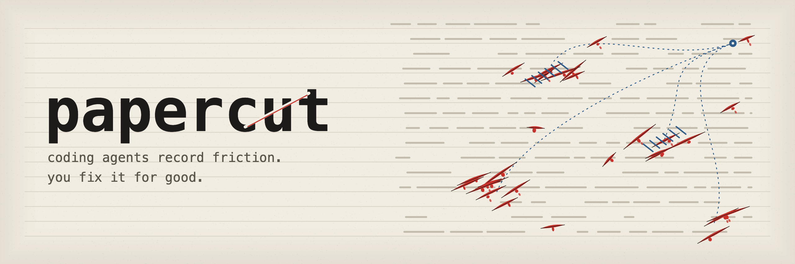

# papercut

[](https://crates.io/crates/papercut-cli)
[](LICENSE)



Coding agents often solve the same avoidable problem twice. One session discovers that
`npm run verify` needs `uv`, works around it, and moves on. The next session hits the
same dead end. **papercut saves that friction while the details are fresh, so you can
fix the underlying setup or instructions later.**

It is a local CLI for Claude Code, Codex, OpenCode, and other agents that can run a
shell command. Reports from all your repos live in one private store. Nothing is
published into a repo unless you explicitly ask for it.

## Quick start

With Rust and Cargo installed:

```sh
cargo install papercut-cli
papercut install --yes
papercut doctor
```

Or from this checkout:

```sh
cargo install --path . --locked
```

`install` adds a short reporting instruction to detected agents' global instruction
files. It also enables automatic failed-command signals for Claude Code. Restart your
agent sessions after installation so they read the new instruction. `doctor` checks
the installation and tells you what needs attention.

Now, in a repo where an avoidable tool or setup problem occurs:

```sh
papercut add -- "npm run verify stopped at 'sh: uv: command not found'; the Python checks require uv on PATH."
papercut list
```

`add` prints the new record's full ID. `list` defaults to the current repo and shows
something like this:

```text
Papercuts · my-repo
1 open

Needs attention (1)

● OPEN  8K3P7M2Q  28 Sep 2026
  npm run verify stopped at 'sh: uv: command not found'; the Python checks require uv
  on PATH.
```

Use the short reference to inspect the complete record: `papercut show 8K3P7M2Q`.
In an interactive terminal, statuses have subtle colors; redirected output stays
plain. `papercut list --repo all` shows reports across repos.

## Why keep these records?

The useful detail is easy to lose: **what was attempted, what happened, and what
actually worked**. A report preserves it with the repo, working directory, agent,
and time. When the same failure appears again, you can distinguish a missing repo
instruction from a machine-wide setup problem. Then you can fix the cause once: add
a setup step, improve an error, pin a tool, or update global agent instructions.

Record observations as facts. Keep uncertain causes and proposed remedies separate:

```sh
papercut add "npm run verify missed og/agents/*.png immediately after astro build; rerunning the check passed." \
  --hypothesis "An overlapping build may have changed dist during the check." \
  --fix "Run the build and check serially."
```

A papercut is an avoidable retry or dead end caused by a repo-specific tool,
command, setup step, error, path convention, or hidden assumption. Ordinary
debugging, product bugs, and feature requests belong elsewhere. One report per
apparent root cause per session is enough; repeated reports across sessions are
useful evidence during review.

## From reports to fixes

Capture is quick; review happens when you have time. List open reports in a repo,
or gather all repos into a bundle an agent can help triage:

```sh
papercut list --status open
papercut triage-pack --repo all --max-tokens 8000
```

During triage, group related reports, verify the cause, make a small fix, and record
why each report was closed. For example, a missing `uv` report can be closed after
`uv` is installed and the locked check passes. Closed records remain visible in
`papercut list`, alongside the resolution, so an old observation is not mistaken
for a current problem:

```text
Reviewed (1)

✓ FIXED  8K3P7M2Q  28 Sep 2026
  npm run verify stopped at 'sh: uv: command not found'; the Python checks require uv
  on PATH.
  ↳ Resolution: Installed uv and confirmed the locked verification passes.
```

See [the triage guide](docs/triage.md) for the review loop
and [the usage guide](docs/USAGE.md#5-close-an-event) for editing a record's status.

Automatic signals help catch friction an agent did not report. Claude Code records
failed Bash commands through an installed hook; Codex session logs can be scanned
with `papercut sweep`. Signals are raw clues, while `papercut add` records a useful
observation in the agent's own words. Neither channel decides the fix for you.

## Privacy and behavior

- Reports and signals stay under `$XDG_DATA_HOME/papercuts/` (by default
  `~/.local/share/papercuts/`). `papercut render --repo . --write` explicitly
  creates a `PAPERCUTS.md` projection in a repo.
- Reports do not automatically read source files, transcripts, or environment
  variables. Do not put secrets in observations or command arguments. Automatic
  signals keep a truncated failed command, exit code, and the first few lines of
  stderr; review that content before sharing a rendered projection.
- The installed capture hook stays silent and cannot fail the agent's task. Direct
  CLI calls report failures with exit codes. All commands are non-interactive;
  `--output json` provides structured results for agents and scripts.

## More detail

- [Usage guide](docs/USAGE.md): every command, flag, and output format.
- [Triage guide](docs/triage.md): turning reports and signals into verified fixes.
- [Design plan](PLAN.md): architecture, schemas, and deliberate non-goals.

For development, run `cargo test` and `cargo clippy --all-targets -- -D warnings`.
The project is MIT-licensed; see [LICENSE](LICENSE).
